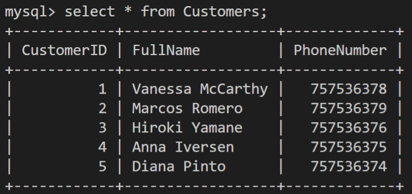
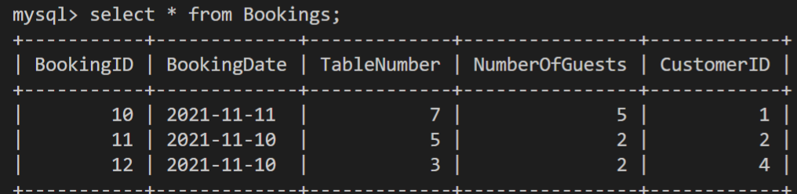
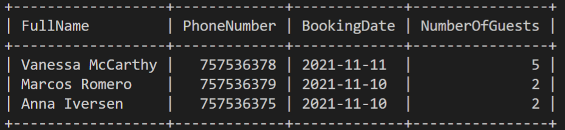
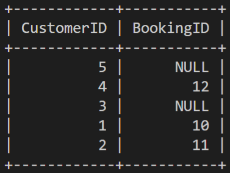

# Practice Joins  
 

## Lab Instructions

Little Lemon is a family-owned Mediterranean restaurant, focused on traditional recipes served with a modern twist. The Little Lemon database contains many tables of data including Customers and Bookings. 

The Customers table contains the following data about each customer: Customer ID, Full name and phone number. 

 

<br> 

The Bookings table contains the following data on each booking: booking ID, booking date, table number, number of guests and the ID of the customer who made the booking. 

 

**Note:** Before you begin, make sure you know how to access [MySQL environment](https://www.coursera.org/learn/database-structures-and-management-with-mysql/supplement/BSZK6/how-to-access-mysql-environment).

### Prerequisites  

To complete this lab, you need to have createad the Little Lemon database MySQL. You must also have created the Customers and the Bookings tables and populated them with relevant data. If you do not have this database or any of the required tables, please read the following instructions.  

1: The code to create the database is as follows: 

```SQL 

CREATE DATABASE little_lemon; 

``` 
 

2: The code to use the database is as follows: 

```SQL 

USE little_lemon; 

``` 

3: The code to create the Customers table is as follows: 
 

```SQL 

CREATE TABLE Customers(  

CustomerID INT NOT NULL PRIMARY KEY,   

FullName VARCHAR(100) NOT NULL,    

PhoneNumber INT NOT NULL UNIQUE  

); 

``` 

4: The code to insert data into Customers table is as follows:

```SQL 

INSERT INTO Customers( CustomerID, FullName, PhoneNumber) VALUES (1, "Vanessa McCarthy", 0757536378), (2, "Marcos Romero", 0757536379), (3, "Hiroki Yamane", 0757536376), (4, "Anna Iversen", 0757536375), (5, "Diana Pinto", 0757536374);   

```   

5: The code to create the Bookings table is as follows:

```SQL 

CREATE TABLE Bookings (  

BookingID INT NOT NULL PRIMARY KEY,  

BookingDate DATE NOT NULL,  

TableNumber INT NOT NULL,   

NumberOfGuests INT NOT NULL CHECK ( NumberOfGuests <= 8),  

CustomerID INT NOT NULL,  

FOREIGN KEY (CustomerID) REFERENCES Customers (CustomerID) ON DELETE CASCADE ON UPDATE CASCADE   
); 

``` 

6. The code to insert data into Bookings table is as follows:

```SQL 

INSERT INTO Bookings ( BookingID, BookingDate, TableNumber, NumberOfGuests, CustomerID) VALUES (10, '2021-11-11', 7, 5, 1), (11, '2021-11-10', 5, 2, 2), (12, '2021-11-10', 3, 2, 4);   

``` 
 
 

## There are two main objectives of this activity:   

* Create an INNER JOIN query. 

* Create a Left JOIN query.  

 

## Task Instructions 

Please attempt the following tasks: 

 

**Task 1:** Little Lemon want a list of all customers who have made bookings. Write an INNER JOIN SQL statement to combine the full name and the phone number of each customer from the Customers table with the related booking date and 'number of guests' from the Bookings table. The expected output result should be the same as the following screenshot (assuming that you have created and populate the tables correctly.) 

 


**Task 2:** Little Lemon want to view information about all existing customers with bookings that have been made so far. This data must include customers who haven’t made any booking yet. Write a LEFT JOIN SQL statement to view the customer id from Customers table and the related booking id from the Bookings table. The expected output result should be the same as the following screenshot (assuming that you have created and populate the tables correctly.)

  

 