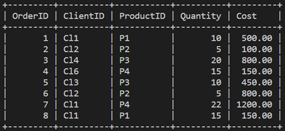

# Working with procedures 

 
# Lab Instructions: Working with procedures 

Lucky Shrub is a medium-sized garden design firm that sells indoor and outdoor plants, making them a one stop shop for clients.  In this lab, you are going to complete the following tasks to make it easier for Lucky Shrub staff to access relevant data from the Orders table using stored procedures.   


The Orders table contains information about the Order ID, Client ID, Product ID, Quantity and Cost as shown below.  

  

Note: Before you begin, make sure you know how to access [MySQL environment](https://www.coursera.org/learn/database-structures-and-management-with-mysql/supplement/BSZK6/how-to-access-mysql-environment).

### Prerequisites  

To complete this lab, you need to have Lucky Shrub database created in MySQL. You must also have the Orders table created and populated with relevant data inside the Lucky Shrub database.  

The code to create the database and the Orders table is as follows:   

1: Create database 

```SQL 

CREATE DATABASE Lucky_Shrub; 

```  

2: Use database 

```SQL 

USE Lucky_Shrub; 

``` 

3: Create Orders table  

```SQL 

CREATE TABLE Orders (OrderID INT, ClientID VARCHAR(10), ProductID VARCHAR(10), Quantity INT, Cost DECIMAL(6, 2));

``` 


4: Insert data 

```SQL 

INSERT INTO Orders (OrderID, ClientID, ProductID , Quantity, Cost) VALUES (1, "Cl1", "P1", 10, 500), (2, "Cl2", "P2", 5, 100), (3, "Cl3", "P3", 20, 800), (4, "Cl4", "P4", 15, 150), (5, "Cl3", "P3", 10, 450), (6, "Cl2", "P2", 5, 800), (7, "Cl1", "P4", 22, 1200), (8, "Cl1", "P1", 15, 150); 

```    

## This activity has three main objectives:   

1. Create stored procedures with empty parameters. 

2. Create stored procedures with two parameters. 

3. Create stored procedures using multiple statements.  

 

## Tasks Instructions 

Please execute the following tasks.

**Task 1**  

    Write a SQL statement that creates a stored procedure called “GetOrdersData” to retrieve all data from the Orders table. 
 
    After executing the query, call the “GetOrdersData” to show all Orders on the MySQL terminal. The expected output result of the call statement is shown below.  

 

 
 

**Task 2**  

    Write a SQL statement that creates a stored procedure called “GetListOfOrdersInRange” with two parameters that determine the range of retrieved data based on the user input of the two cost values “MinimumValue” and “MaximumValue”. 

    After executing the query, call the  “GetListOfOrdersInRange” to display the data of orders that cost between 150 and 600. The expected output result of the call statement is shown below. 

 


 
 